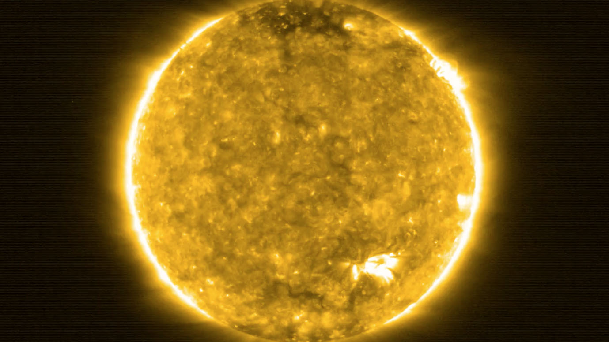

# confEMD
Empirical Mode Decomposition (EMD) technique for identifying quasi-periodic oscillations in the solar atmosphere from superimposed background noises.

## Project description
confEMD is the project to detect quasi-periodicities in the solar atmosphere using the EMD technique. These oscillatory signals are typically accompanied by a combination of white noise and coloured noise with power law spectral dependence. To detect quasi-periodicities, we compute the EMD spectrum containing EMD-revealed modes and the confidence limits of modal energy. This allows us to identify the significant mode beyond the confidence limits, which is expected to be associated with the quasi-periodic oscillatory signal of interest.

The project consists of three main parts:
- Estimation of power law index and noise energy using a debiased least squares fit of Fourier spectrum based on the method given by [Vaughan (2005)](https://doi.org/10.1051/0004-6361:20041453).
- Extraction of the dominant period of EMD-revealed modes from the global wavelet spectrum produced by the Wavelet analysis package from https://github.com/ct6502/wavelets.
- Calculation of confidence limits of EMD spectrum using the method proposed by [Kolotkov et al. (2016)](https://doi.org/10.1051/0004-6361/201628306).


## Table of Contents
- [Prerequisites](#prerequisites)
- [Installation](#installation)
- [Example](#example)
- [Contributing](#contributing)
- [License](#license)

## Prerequisites
- Leave blank

## Installation
 - Leave blank

## Example
The sample signal in this example consists of an oscillatory component, a decaying trend and some random noise signals:


After setting the mean of the signal to zero, we apply EMD to obtain the first set of intrinsic mode functions (IMFs):


The trend of the signal is estimated using the 'emd_trend' function. This function identifies modes with periods exceeding a fraction of the total signal duration (denoted by the 'cutoff' parameter) as the trend of the signal.


Place here your tutorial base on your emd example

To write any code, use this snippet
```python
import numpy as np

array = np.array([0, 1, 2)]
```
To insert you plots, use the command below (use should place your plot into the use-case folder):


## Contributing
Leave blank

## Acknowledgements
Leave blank

## License
This project is licensed under the Apache 2.0. License - see the [LICENSE.md](./LICENSE) file for details


