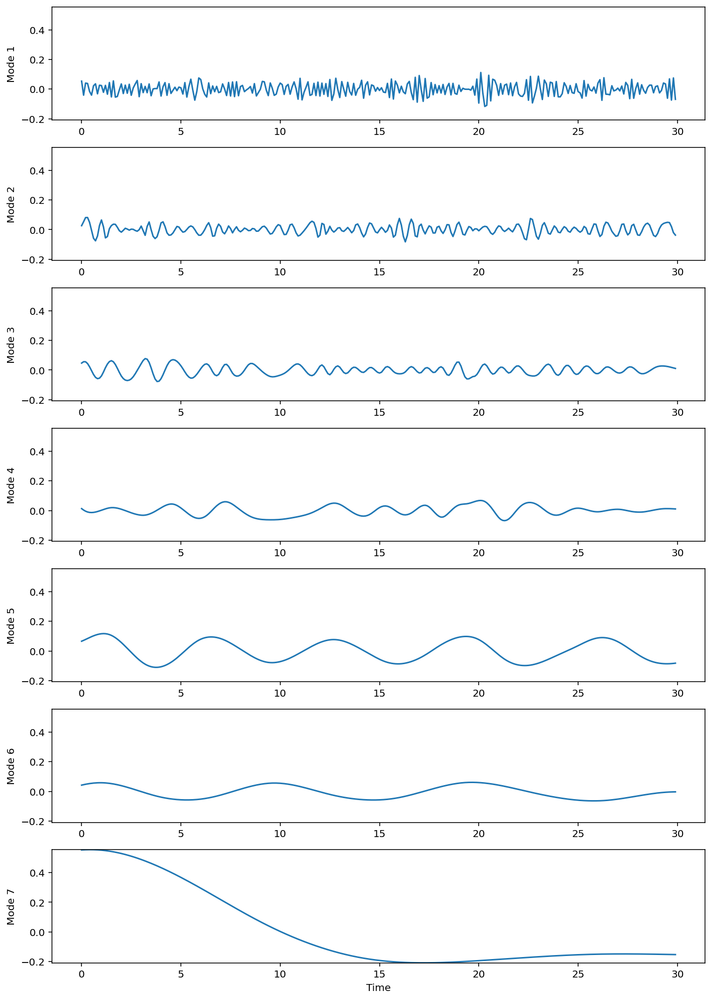
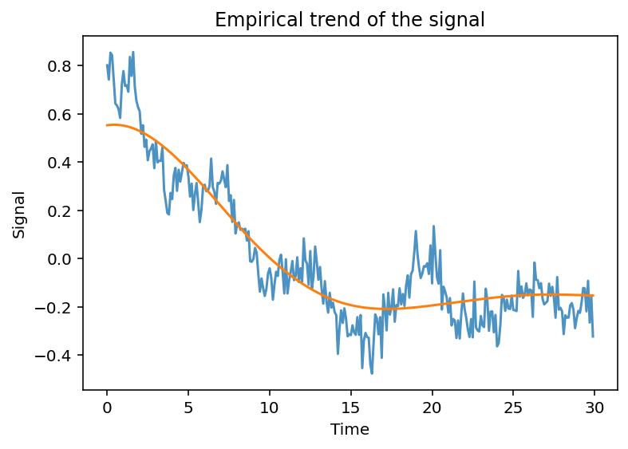
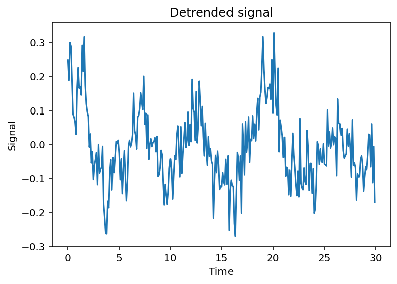
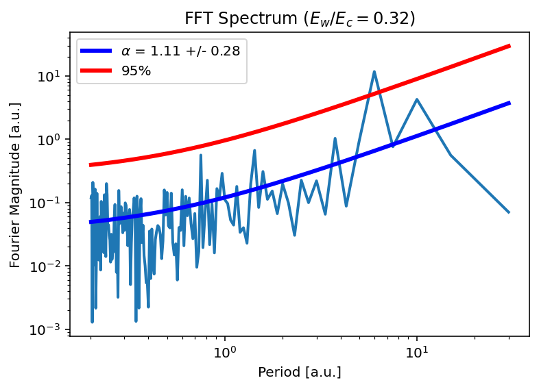
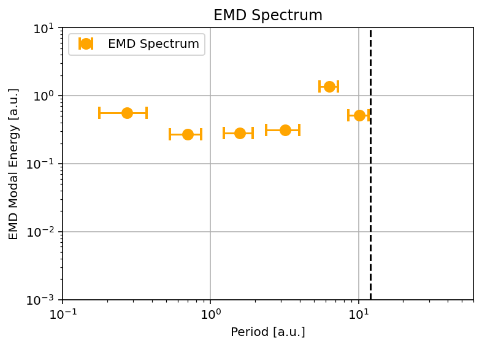
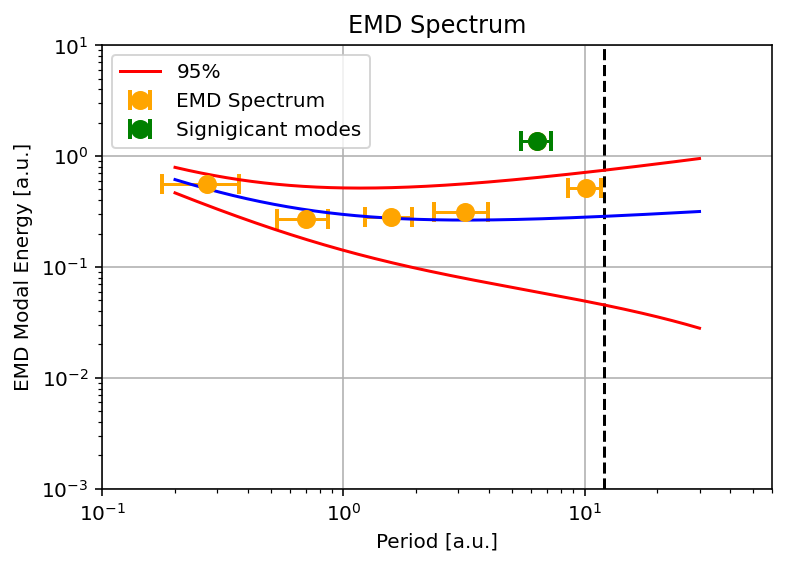
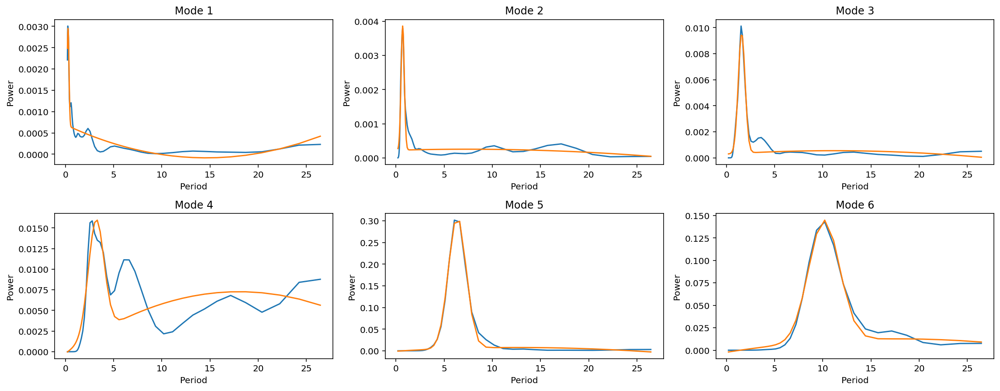
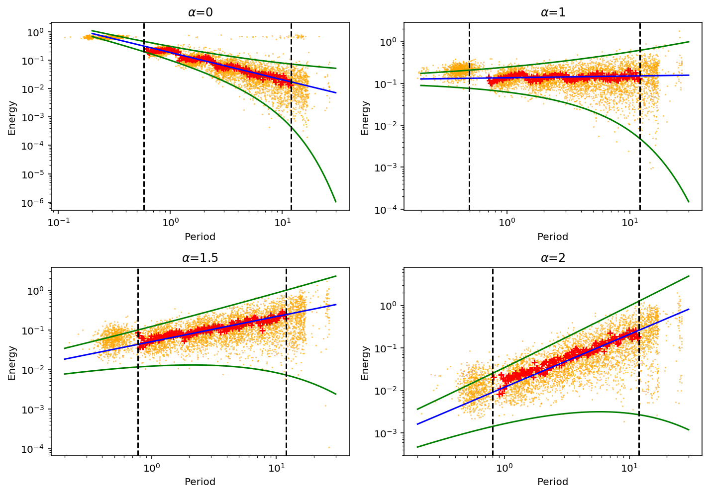

# `scope`


`scope` - Statistical Confidence of Oscillatory Processes with EMD (Empirical Mode Decomposition).

## Project description
`scope` is the Python-based package for detecting oscillatory signals in observational or experimental time series with the EMD technique and assessing their statistical significance vs. power-law distributed background noise. Oscillatory processes in real data sets of various origins are often contaminated by a combination of white and coloured noise with a power-law spectral dependence, so that the EMD-revealed intrinsic mode functions need to be rigorously tested against the periodic components generated by noise. To do so, we compute the _EMD energy spectrum_ containing the total energy and dominant period of each EMD-revealed intrinsic mode and the noise confidence limits for modal energy. This allows us to identify the significant mode(s) with the energy beyond the confidence limits, which is expected to be of a non-noise origin and associated with a quasi-periodic oscillatory process of interest. The developed package does not assume the physical origin of the input data set, making it readily applicable for analysing oscillatory processes across various fields of science and industry.

The project consists of the following main parts:
- Perform EMD analysis of the original time series and reveal the set of intrinsic modes using [Empirical Mode Decomposition in Python](https://emd.readthedocs.io/en/stable/) ([Quinn et al. 2021](https://doi.org/10.21105/joss.02977)) package. See function `emd_modes` from `emd` module in `scope`.
- Estimation of the power-law index and energy of superimposed background noise from the Fourier power spectrum as described in [Vaughan (2005)](https://doi.org/10.1051/0004-6361:20041453). See function `fit_fourier` from `fourier` module in `scope`.
- Estimation of the dominant period of each EMD-revealed intrinsic mode from the global wavelet spectrum produced with [Torrence & Compo Wavelet Analysis Software](https://github.com/ct6502/wavelets) ([Torrence & Compo 1998](https://psl.noaa.gov/people/gilbert.p.compo/Torrence_compo1998.pdf)) package. See function `emd_period_energy` from `emd` module in `scope`.
- Calculate EMD confidence limits using the method proposed by [Kolotkov et al. (2016)](https://doi.org/10.1051/0004-6361/201628306). See function `emd_noise_conf` from `emd` module in `scope`.
- Visualise the results with `plot_signal`, `plot_modes`, `plot_fft_spectrum`, and `plot_emd_spectrum` functions from `utils` module.


## Table of Contents
- [Prerequisites](#prerequisites)
- [Installation](#installation)
- [Example](#example)
- [Contributing](#contributing)
- [License](#license)

## Prerequisites
- Leave blank

## Installation
 - Leave blank

## Example
The sample signal in this example consists of an oscillatory component, a decaying trend and some random noise signals obeying power law: \


After setting the mean of the signal to zero, we apply EMD to obtain the first set of intrinsic mode functions (IMFs):
```python
modes = emd_modes(x, sd_thresh=1e-4)
plot_modes(t, modes)
```
where the 'sd_thresh' parameter is the threshold at which the sift of each IMF will stop. 


The trend of the signal is estimated using the 'emd_trend' function. This function identifies modes with periods exceeding a fraction of the total signal duration (denoted by the 'cutoff' parameter) and the residual as the trend of the signal. This cutoff is 0.4*signal length by default, which means that mode with less than 2.5 oscillations is considered as part of the trend. 
```python
modes = emd_trend(modes, t)
trend_emd = modes[:, -1]
plot_signal(t, trend_emd, 'Trend of the signal')
```
For this simple example, the trend of the signal is simply the residual of EMD: \


Hence the detrended signal is: \


Now we can estimate the noise parameters of the actual part of the signal we are interested in, the detrended signal, by the 'fit_fourier' function. The function returns the noise parameters of coloured noise and white noise (if present). For this example, the FFT spectrum of the detrended signal shows a combination of white and coloured noise, with the power law index of this coloured noise being 1.61±0.49. The peak outside the 95% confidence level (false alarm probability = 0.05) is expected to be the period of the oscillatory signal.
```python
fit_fft = fit_fourier(x, dt, fap=0.05)
plot_fft_spectrum(fit_fft)
```


The EMD energy spectrum is computed by the 'emd_energy_spectrum' function:
```python
emd_sp = emd_energy_spectrum(modes, t, plot_fitting=True)
cutoff_period = 0.4 * len(x) * dt #show cutoff period
plot_emd_spectrum(emd_sp, cutoff_period)
```
 

The dashed line corresponds to the cutoff period adopted in 'emd_trend' function, all modes beyond this line are considered as components of trend.

With the power law index and noise energy returned by 'fit_fourier' function, we can compute the confidence limits of the EMD energy spectrum using 'emd_noise_conf' function:
```python
# false alarm probability
fap = 0.05
#Confidence limits for coloured noise
conf_c = emd_noise_conf(t, alpha=alpha, period_min=2*dt, 
                        period_max=N*dt, num_samples=500, 
                        signal_energy=fit_fft['color_energy'], fap=fap)
#Confidence limits for white noise
if fit_fft['white_energy'] > 0: # check if there is only colored noise model
    conf_w = emd_noise_conf(t, alpha=0, period_min=2*dt,
                            period_max=N*dt, num_samples = 500, 
                            signal_energy=fit_fft['white_energy'], fap=fap)
```
Here the false alarm probability (fap) is set to 0.05. The 'emd_noise_conf' function generates 500 noise samples with the same power law index ('alpha') and energy ('signal_energy') as the input. The other two parameters 'period_min' and 'period_max' set the range of period over which the confidence limits will be computed. The EMD energy spectrum with confidence limits is given by: \
 

The modes beyond the upper confidence limit are considered as significant modes that may not be considered as random noise.

## Description of Functions 
### 'emd_period_energy'
As mentioned in the examples section, the 'emd_trend' function selects trends using modal period. The (dominant) period of a mode is estimated by fitting the global wavelet spectrum of the mode with a Gaussian + Parabolic function, conducted in the 'emd_period_energy' function. An example of the global wavelet spectrum fit is shown below: \

We can see that for each mode there is a Gaussian-like peak associated with the dominant period. The position and standard deviation of the Gaussian peak refers to the dominant period and the uncertainty of this estimation.

### 'fit_fourier'
In the 'fit_fourier' function, we fit the FFT spectrum by a power law model in log-log scale to extract the power law index and noise energy of the signal. Firstly, we must note that each point of the Fourier power $I(f_{j})$ follows a chi-square distribution with 2 degrees of freedom, denoted as:
```math
I(f_{j}) = \mathcal{P}(f_{j}) \chi_{2}^{2}/2
```
where $\mathcal{P}(f_{j})$ is the true power spectrum, and $\chi_{2}^{2}$ is a random variable distributed as $\chi^{2}$ with 2 degrees of freedom. Since the least squares method assumes that each point is Gaussian-distributed, we cannot directly apply this method in the FFT spectrum fitting. Instead, we should consider the mean of the $\chi_{2}^{2}/2$ term. In log scale, $\left\langle \mathrm{log}(\chi^{2}_{2}/2) \right\rangle$ = -0.25068. This term corresponds to the bias that will be introduced to the fitting if we directly implement the least squares method. Hence, we shall include this term in the model function such that the least squares fitting will not be 'biased'.

Additionally, we can visualise this bias factor. Since the Fourier power follows a chi-square distribution with 2 DoF is essentially an exponential function, we consider the integration of an exponential function over the entire range of power, which gives a constant value:
```math
\int_{0}^{P_{\mathrm{max}}} e^{-x} dx = const.
```
One can transform it to log scale by considering a new variable $τ = lnx$. Hence, the new integral becomes:
```math
\int_{-\infty}^{\mathrm{ln} P_{\mathrm{max}}} e^{-e^{\tau}} e^{\tau} d\tau = const.
```
where $F(\tau) = e^{-e^{\tau}} e^{\tau}$ is the distribution of the Fourier power in log scale. By plotting this function we see an asymmetric distribution with its mean positioned at -0.25068.


The power law model is a superposition of white and coloured noises, given by:
```math
 \mathcal{P}(f) = \mathcal{P}_{c}(f) + \mathcal{P}_{w}(f) = N_{c} f^{-\alpha_{c}} + N_{w}
```
where $N_{c}$ and $N_{w}$ are the proportionality constants of coloured and white noises respectively, and $\alpha_{c}$ is the power law index of coloured noise. After obtaining the proportionality constants from the debiased least squares fit, we can estimate the energy of each noise type using:
```math
\text{Energy} = N \cdot nf \cdot N_{c/w} 
```
where $N$ is the number of data points in time series and $nf$ is the number of Fourier frequencies, which does not include 0 Hz and Nyquist frequency.

### 'emd_noise_conf'
[Flandrin et al. (2004)](https://ieeexplore.ieee.org/document/1261951) and [Wu and Huang (2004)](https://royalsocietypublishing.org/doi/10.1098/rspa.2003.1221) investigate the dyadic property of EMD and suggest the following relation between modal energy and modal period:
```math
E_{m}P_{m} = \text{const.}
```


[Kolotkov et al. (2016)](https://doi.org/10.1051/0004-6361/201628306) suggests that the modal energy of the mth IMF should have a chi-square distribution with the $k$ degrees of freedom (DoF). We thus estimate the confidence limits using the percent-point function of the chi-square distribution. Here we use the false alarm probability = 0.05. The 'emd_noise_conf' function generates 500 (by default) noise samples with the same power law index and energy as the input and conducts the EMD. It extracts the dominant period and modal energy for each IMF by calling the 'emd_period_energy' function. The 'emd_noise_fit' function fits the chi-square distribution to the histogram of modal energy for each mode number to extract the mean energy and $k$. We obtain the mean period, mean energy and number of DoF for each mode number. Due to the dyadic property of EMD, we expect both mean energy vs mean period and $k$ vs mean period are linear in log-log scale. The exact linear relationship is found by fitting a straight line. By obtaining this linear relationship, we use it to generate 500 data points of the confidence limits over the whole range of period.

## Contributing
Leave blank

## Acknowledgements
Leave blank

## License
This project is licensed under the Apache 2.0. License - see the [LICENSE.md](./LICENSE) file for details


